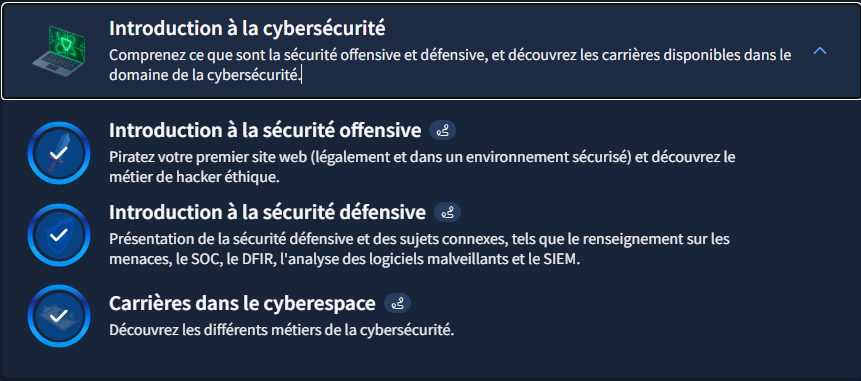

# TryHackMe - Introduction à la cybersécurité

## Writeup - Module "Introduction à la cybersécurité"

### Objectif du Module
Comprendre les concepts de sécurité offensive et défensive, et découvrir les carrières disponibles dans le domaine.

---

### Concepts clés appris

#### Sécurité Offensive (Red Team)
- Simulation d'attaques pour identifier des vulnérabilités.
- Méthodes : Pentest, Red Teaming, Tests d'intrusion.

#### Sécurité Défensive (Blue Team)
- Protection des systèmes et réponse aux attaques.
- Domaines : SOC (Security Operations Center), détection d'intrusions, réponse aux incidents.

---

### Mon retour d'expérience :

#### Ce que j'ai compris
La cybersécurité est bien plus vaste que je ne l'imaginais. C'est une discipline méthodique, éthique et passionnante qui nécessite une compréhension profonde des systèmes avant de pouvoir les attaquer ou les défendre.

#### Difficultés rencontrées
La distinction précise entre les rôles (Red vs. Blue) au début de l'apprentissage.

#### Application à mes objectifs
À terme, en freelance, je vise les rôles de :
1.  **Red Teamer**
2.  **Spécialiste en ingénierie sociale** (avec intégration d'IA)
3.  **Développeur d'outils offensifs**

---

## Focus détaillé : Sécurité Défensive (Blue Team)
La Blue Team construit et maintient les défenses :
*   **Surveillance** (*monitoring*) et détection des intrusions.
*   **Réponse aux incidents** de sécurité.
*   **Mise en place** de pare-feux et systèmes de protection.
*   **Analyse des logs** et investigation (Forensics).
*   **Gestion des correctifs** (*patch management*).

---

## Preuve de complétion

### Capture d'écran TryHackMe

* **Module terminé à 100%**
* **Date :** 23/12/2025
* **Plateforme :** TryHackMe

---

*Writeup rédigé par **Norbert Aziamadji** dans le cadre de mon apprentissage en cybersécurité.*  
*Étudiant en cybersécurité au Bénin | [GitHub](https://github.com/norbertaziamadji) | [TryHackMe](https://tryhackme.com/p/DarkGhost6)*

**Dernière mise à jour :** 26/12/2025