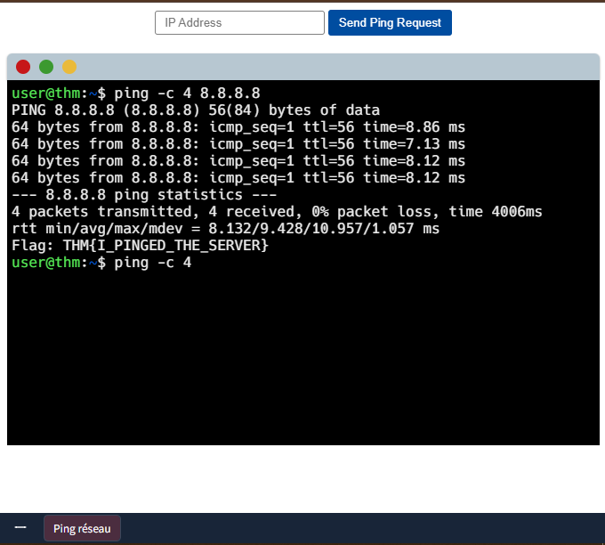
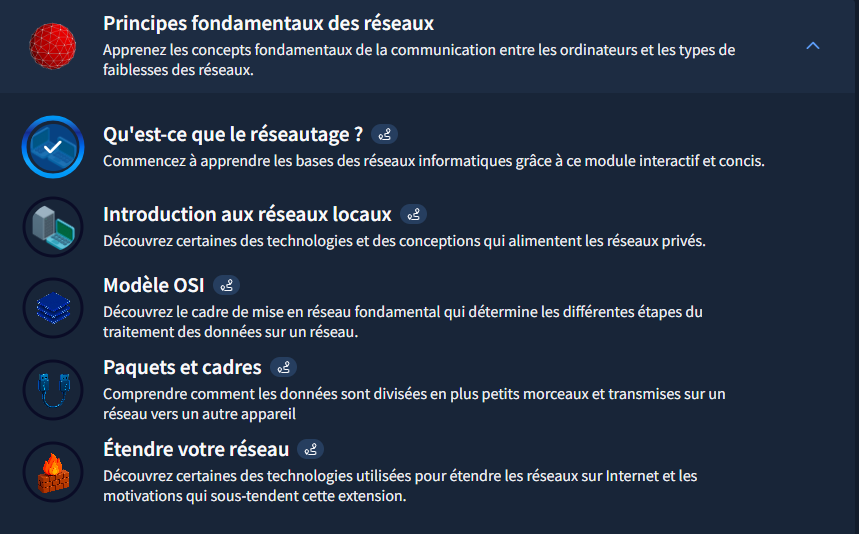

# TryHackMe - Les fondamentaux du réseau

## Writeup - Module "Network Fundamentals"

### Objectif du Module
Apprendre les bases des réseaux informatiques : adressage, protocoles et communication entre appareils.

---

### Concepts clés appris

#### Notions Fondamentales
- **Réseautage (Networking)** : Interconnexion d'appareils (de 2 à des milliards)
- **Internet** : Réseau géant composé de réseaux plus petits
- **Types de réseaux** : Privé (interne) vs Public (accessible)

#### Identification des Appareils
- **Adresse IP** (IPv4/IPv6) : Identifiant unique d'un appareil sur un réseau
  - IPv4 : 4,29 milliards d'adresses (pénurie actuelle)
  - IPv6 : 340 billions d'adresses (solution long terme)
- **Adresse MAC** : Identifiant matériel unique de l'interface réseau
  - Format : 12 caractères hexadécimaux (ex: a4:c3:f0:85:ac:2d)
  - 6 premiers = fabricant, 6 derniers = numéro unique

#### Protocoles de Communication
- **Ping (ICMP)** : Vérifie la connectivité et mesure les performances
  - Utilise les paquets echo request/echo reply
  - Mesure le temps aller-retour entre appareils

---

### Mon retour d'expérience

#### Ce que j'ai compris
Un réseau local peut commencer avec seulement deux appareils. Comprendre la différence entre **adresse IP** (logique, réseau) et **adresse MAC** (physique, matériel) est fondamental pour identifier les appareils. Le **ping (ICMP)** permet de diagnostiquer la connectivité en mesurant les temps de réponse.

> "L'adresse MAC identifie le matériel, l'adresse IP identifie l'appareil sur le réseau. L'une est physique (usine), l'autre est logique (configuration)."

#### Difficultés rencontrées
Aucune pour cette introduction, les concepts étaient bien expliqués.

---

#### Application pratique

* Commande de test de connectivité de base :

`ping -c 4 8.8.8.8`

### Preuve du test ping -c 4 8.8.8.8

### Capture d'écran TryHackMe

* **Module terminé à 20%**
* **Date :** 23/12/2025
* **Plateforme :** TryHackMe

**Note :** J'utilise un compte TryHackMe gratuit pour le moment.

---

*Writeup rédigé par **Norbert Aziamadji** dans le cadre de mon apprentissage en cybersécurité.*  
*Étudiant en cybersécurité au Bénin | [GitHub](https://github.com/norbertaziamadji) | [TryHackMe](https://tryhackme.com/p/DarkGhost6)*

**Dernière mise à jour :** 26/12/2025

