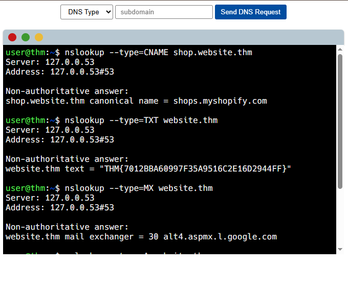
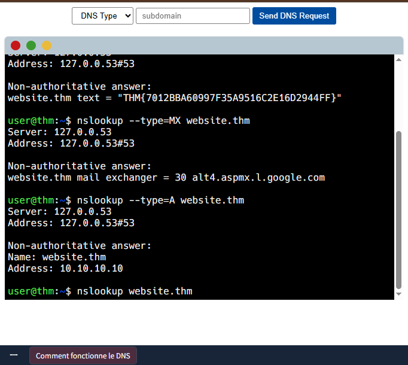
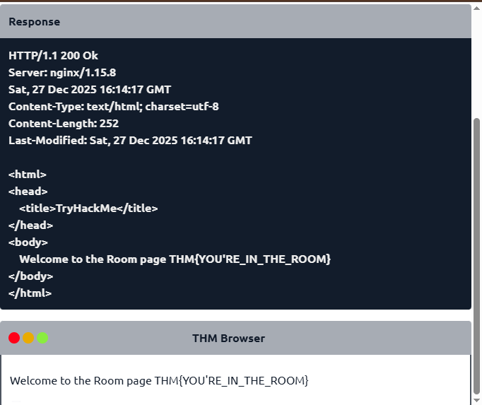
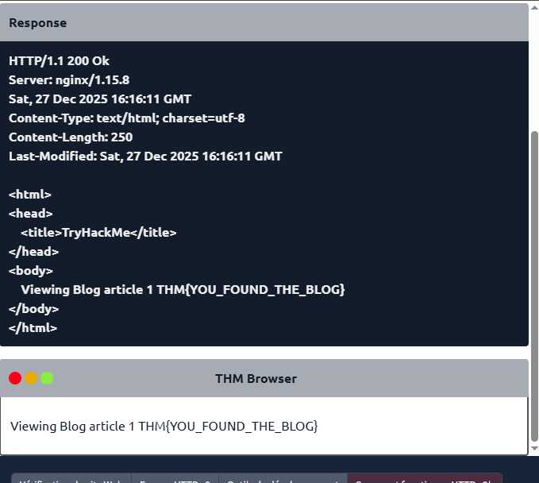
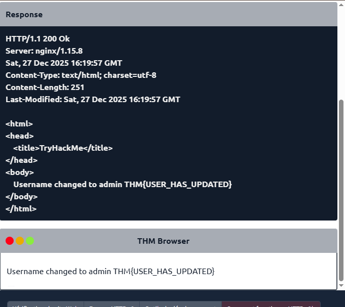
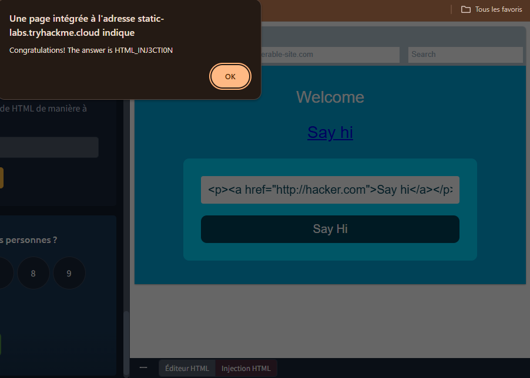
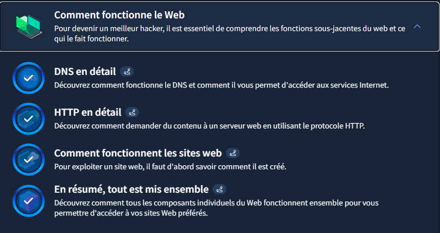

# TryHackMe - Comment fonctionne le web

## Writeup - Module "Comment fonctionne le web"

### Objectif du Module
Comprendre les fonctions sous-jacentes du web et ce qui le fait fonctionner.

---

### Concepts clés appris

#### Notions Fondamentales :

                        DNS in Detail

- **DNS (Domain Name System)** : moyen de communication entre appareils sur internet sans se souvenir de chiffres complexes.
- Dans l'hiérarchie du domaine, il y a 3 niveaux de domaines :
1. Root Domain qui est : "."
2. Top-Level Domain comme : .edu -- .com -- .gov -- .mil
3. Second-Level Domain comme : MIT -- Google, TryHackMe -- USA, NASA -- Army
- **TLD** : partie la plus droite d'un nom de domaine.

Il existe deux types de **TLD** : gTLD (Generic Top Level) et ccTLD 
(Country Code Top Level Domain).
un gTLD était destiné à indiquer à l'utilisateur le but du nom de domaine; par exemple, un .com serait à des fins commerciales, .org 
pour une organisation, .edu pour l'éducation et .gov pour le gouvernement. 

Et un ccTLD a été utilisé à des fins géographiques, par exemple, .ca pour les sites basés au Canada, .co.uk 
pour les sites basés au Royaume-Uni et ainsi de suite. 
Prenant tryhackme.com comme exemple, la partie .com est le TLD, et tryhackme est le domaine de second niveau.

Un sous-domaine se trouve sur le côté gauche du domaine de second niveau en utilisant une période pour le séparer; par exemple, dans le nom admin.tryhackme.com, la partie 
d'administration est le sous-domaine. 

- Types d'enregistrements DNS : **Record, AAAA, CNAME Record, MXRecord, Enregistrement TXT**

---

#### Application pratique :
- Quelques commandes de test pour DNS :

    - ``nslookup --type=CNAME shop.website.thm`` ----> Voir le CNAME de shop.website.thm
    - ``nslookup --type=TXT website.thm`` ----> Voir la valeur de l'enregistrement TXT de website.thm
    - ``nslookup --type=MX website.thm`` ----> Voir la valeur numérique de priorité pour l'enregistrement MX
    - ``nslookup --type=A www.website.thm`` ----> Voir l'adresse IP pour le dossier A de www.website.thm

---

### Application pratique

#### Preuve du test DNS :

---

                    HTTP in detail

- **HTTP (HyperText Transfer Protocol)** : ensemble de règles utilisées pour 
communiquer avec les serveurs Web pour la transmission de données de page Web, qu'il s'agisse de HTML, d'images, de vidéos, etc. *(développé par Tim Berners-Lee et son équipe)*

- **HTTPS (HyperText Transfer Protocol Secure)** : version sécurisée de HTTP. Les données HTTPS sont cryptées.

- **URL (Uniform resource locator)** : instruction sur la façon d'accéder à une ressource sur Internet.

Une URL est composé de 6 fonctionnalités. Elle n'utilise pas toutes les fonctionnalités 
dans chaque demande. On a :

    - Scheme ( Schéma )

    - User ( Utilisateur )

    - Host/Domain ( Hote )

    - Port

    - Path ( Chemin )

    - Query String ( Chaîne de requête )

    - Fragment

En ce qui concerne les méthodes HTTP, nous en avons 4 dont **GET, POST, PUT et DELETE**

Lorsqu'un serveur HTTP répond, la première ligne contient toujours un *code* d'état informant le client du résultat de sa demande et 
potentiellement comment la traiter. Ces codes d'état peuvent être décomposés en 5 gammes différentes:

    - 100-199 ----> Réponse à l'information
    - 200-299 ----> Succès
    - 300-399 ----> Redirection
    - 400-499 ----> Erreurs du client
    - 500-599 ----> Erreurs de serveur

Quelques *codes d'états* les plus courants que nous rencontrons presque tout les jours depuis nos navigateurs :

- 200 - OK
- 201 - Créé
- 301 - Déplacé de façon permanente
- 302 - Trouvé
- 400 - Mauvaise demande
- 401 - Non Autorisé
- 403 - Interdit
- 405 - Méthode Non Autorisée
- 404 - Page Non Trouvée
- 500 - Erreur de service interne
- 503 - Service Indisponible

Les *en-têtes* sont des bits de données supplémentaires que vous pouvez envoyer au serveur Web lors de demandes. Nous avons deux types d'en-tetes :

* En-têtes de requête communs composé de : Host, User-Agent, Content-Length, Accept-Encoding, Cookie.

* En-têtes de réponse communs composé de : Set-Cookie, Cache-Control, Content-Type,
Content-Encoding.

**Cookies** : petit morceau de données qui est stocké sur notre ordinateur.

---

### Application pratique :

#### Preuve des test HTTP avec les méthodes GET, DELETE, PUT , POST
- GET

- GET avec id = 1

- DELETE

- PUT

- POST

---

                    How The Web Works

Lorsque qu'on visite un site Web, notre navigateur (comme Safari ou Google Chrome) fait une demande à un serveur Web demandant des informations sur la page qu'on souhaite visitez. Il répondra avec les données que notre navigateur utilise pour nous montrer la page; un **serveur Web** n'est qu'un ordinateur dédié ailleurs dans le monde qui traite vos demandes.

Il y a deux composantes majeures qui composent un site Web:

1. *Front End (Client-Side)* : la façon dont notre navigateur rend un site Web grace aux HTML, CSS et JS.
2. *Back End (Server-Side)* : un serveur qui traite notre demande et renvoie une réponse grace aux PHP, Python et autres languages algorithmiques pour serveur.

    * **Note** : Lorsque qu'on évalue la sécurité d'une application web, l'une des premières choses à faire est d'examiner le code source de la page pour voir si l'on peut trouver des identifiants de 
connexion exposés ou des liens cachés.

**L'injection HTML** est une vulnérabilité qui se produit lorsque des données saisies par l'utilisateur ne sont pas filtrées et affichées sur une page.  Si un site web ne parvient pas à assainir les données saisies par l'utilisateur (c'est-à-dire à filtrer tout texte potentiellement malveillant) et que ces données sont utilisées sur la page, un attaquant peut injecter du code HTML 
dans le site vulnérable.

    La règle générale est de ne jamais se fier aux données saisies par l'utilisateur. Pour éviter toute saisie malveillante, le développeur du site web doit nettoyer systématiquement toutes 
    les données saisies par l'utilisateur avant de les utiliser dans la fonction JavaScript ; par exemple, il pourrait supprimer les balises HTML.

---

### Application pratique :

#### Injection de code HTML malveillant :
**But** : Injection du code HTML de manière à afficher un lien malveillant vers *http://hacker.com.*

---

### Ce que j'ai compris :
En résumé, lorsque qu'on consulte un site web, notre ordinateur doit connaître l'adresse IP du serveur auquel il doit se connecter ; pour cela, il utilise le DNS . Notre ordinateur 
communique ensuite avec le serveur web grâce à un ensemble de commandes spécifiques appelé protocole HTTP ; le serveur web renvoie alors du code HTML, JavaScript, CSS, des 
images, etc., que notre navigateur utilise pour formater et afficher correctement le site web.

Il existe également quelques autres composants qui contribuent à un fonctionnement plus efficace du Web et offrent des fonctionnalités supplémentaires tels qu'un **équilibreurs de charge, un CDN ( Content Delivery Networks ), une base de données, un WAF ( Web Application Firewall ).**

* **Note** : Un serveur web est un logiciel qui écoute les connexions entrantes et utilise le protocole HTTP pour fournir du contenu web à ses clients.

---

### Capture d'écran TryHackMe

* **Module terminé à 100%**
* **Date :** 24/12/2025
* **Plateforme :** TryHackMe

**Note :** J'utilise un compte TryHackMe gratuit pour le moment.

---

*Writeup rédigé par **Norbert Aziamadji** dans le cadre de mon apprentissage en cybersécurité.*  
*Étudiant en cybersécurité au Bénin | [GitHub](https://github.com/norbertaziamadji) | [TryHackMe](https://tryhackme.com/p/DarkGhost6)*

**Dernière mise à jour :** 27/12/2025
