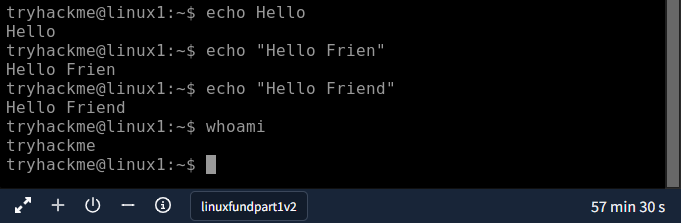
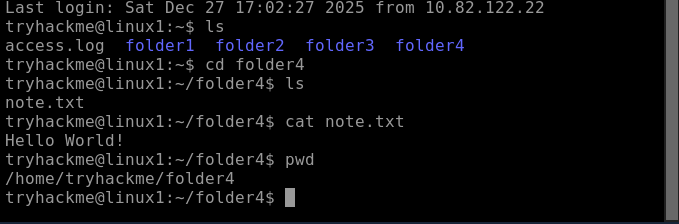
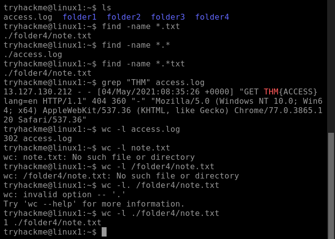
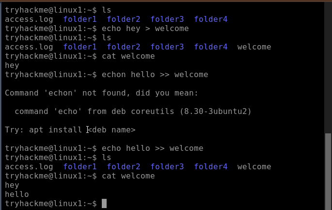
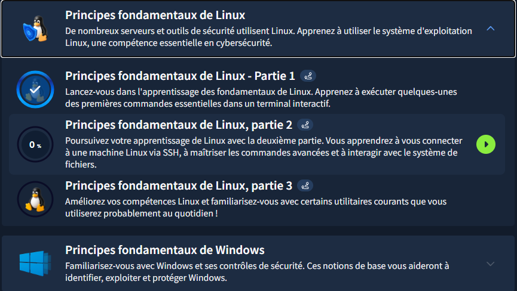

# TryHackMe - Les fondamentaux de Linux

## Writeup - Module "Les fondamentaux de Linux"

### Objectif du Module
Apprendre à utiliser le système d'exploitation Linux, une compétence essentielle en cybersécurité.

---

### Concepts clés appris

#### Notions Fondamentales :
Linux, créé par Linus Torvalds, a été publié pour la première fois le 17 septembre 1991. C'est aujourd'hui un système d'exploitation incontournable en cybersécurité.

Nous l' utilisons quotidiennement, sous une forme ou une autre ! Linux est notamment utilisé pour :

- Sites Web que nous visitons.
- Panneaux de commande/divertissement pour voiture
- Les systèmes de point de vente (PDV) tels que les caisses enregistreuses et les terminaux de paiement dans les magasins
- Infrastructures critiques telles que les contrôleurs de feux de circulation ou les capteurs industriels

#### Importance de Linux en Cybersécurité
- **Outils de hacking** : La majorité des outils (Kali, Metasploit) tournent sur Linux
- **Transparence** : Open source → on peut auditer le code
- **Contrôle** : Accès complet au système via terminal
- **Stabilité** : Moins vulnérable aux malwares que Windows

---

### Application pratique :

* **Mes premières commandes** :

| Commande | Description  | Exemple |
|:---------|:-------------|:---------:|
| echo |	Afficher tout texte que nous fournissons |echo Hello|
| whoami | Savoir quel utilisateur nous utilisons actuellement ! | echo "Hello Friend !" |

* **Preuve** :

---

* **Interaction avec le système de fichiers :**

| Commande |	Description	| Exemple |
|:---------|:---------------|:-------:|
| ls | list	| Utiliser « ls » pour lister le contenu du répertoire courant |
| cd | changer de répertoire | cd Images | 
| cat | afficher le contenu d'un fichier | cat todo.txt |
| pwd | afficher le répertoire de travail |Utilisez « pwd » pour afficher le chemin complet du répertoire courant. |

* **Preuve** :

---

* **Recherche de fichiers** :

| Commande | Description | Exemple |
|:---------|:------------|:-------:|
| find | permet de rechercher un fichier | find -name passwords.txt |
| find | trouver n'importe quel fichier ayant l'extension « .txt » | find -name *.txt |
| grep | rechercher dans les fichiers des valeurs spécifiques. | grep "81.143.211.90" access.log |
| wc | compter le nombre d'entrées dans « access.log »	| wc -l access.log |

* **Preuve** :

---

* **Introduction aux opérateurs Shell** :

| Symbole /Opérateur | Description	| Exemple |
|:-------------------|:-------------|:-------:|
| &	| Cet opérateur nous permet d'exécuter des commandes en arrière-plan de notre terminal. |  python3 -m http.server 80 & |
| && | Cet opérateur nous permet de combiner plusieurs commandes sur une seule ligne de notre terminal. | command1 && command2 |
| >	| Cet opérateur est un redirecteur, ce qui signifie que nous pouvons prendre la sortie d'une commande (comme l'utilisation de cat pour afficher un fichier) et la rediriger ailleurs. | echo hey > welcome |
| >> | Cet opérateur remplit la même fonction que l'opérateur précédent, mais ajoute la sortie au lieu de la remplacer (ce qui signifie que rien n'est écrasé). | echo hello >> welcome |

* **Preuve** :

---

### Ce que j'ai retenu :

J'ai pu comprendre pourquoi Linux est si répandu aujourd'hui. Interagir avec une machine virtuelle Linux ! J'ai exécuté certaines des commandes les plus fondamentales en interagisant avec le système de fichiers tout en apprenant la façon dont nous pouvons utiliser des commandes comme find et grep pour rendre la recherche de données encore plus efficace tout en améliorant également mes compétences en commandes en découvrant certains des opérateurs shell les plus importants.

---

### Capture d'écran TryHackMe

* **Module terminé à 20%**
* **Date :** 25/12/2025
* **Plateforme :** TryHackMe

**Note :** J'utilise un compte TryHackMe gratuit pour le moment.

---

*Writeup rédigé par **Norbert Aziamadji** dans le cadre de mon apprentissage en cybersécurité.*  
*Étudiant en cybersécurité au Bénin | [GitHub](https://github.com/norbertaziamadji) | [TryHackMe](https://tryhackme.com/p/DarkGhost6)*

**Dernière mise à jour :** 27/12/2025

