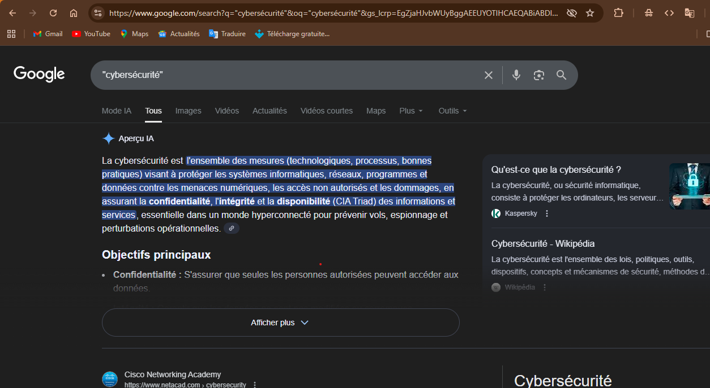
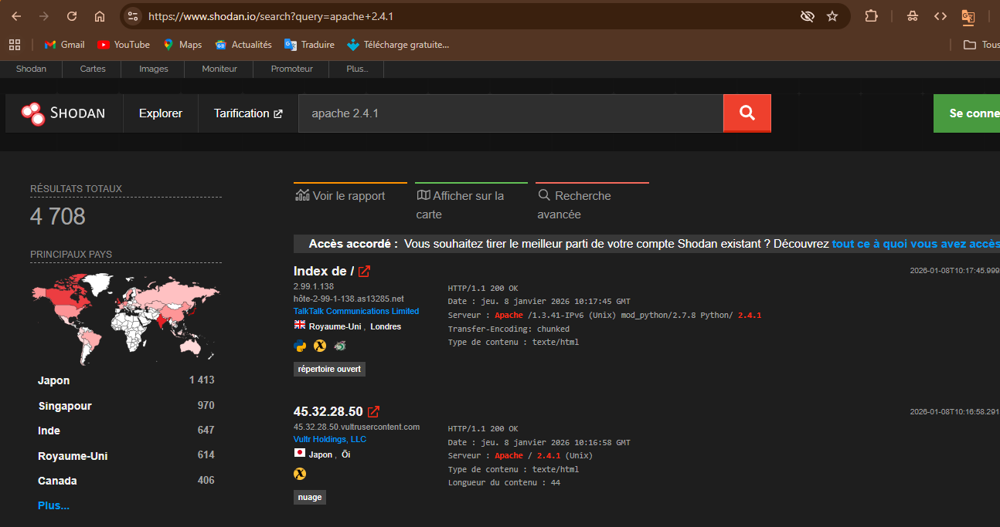
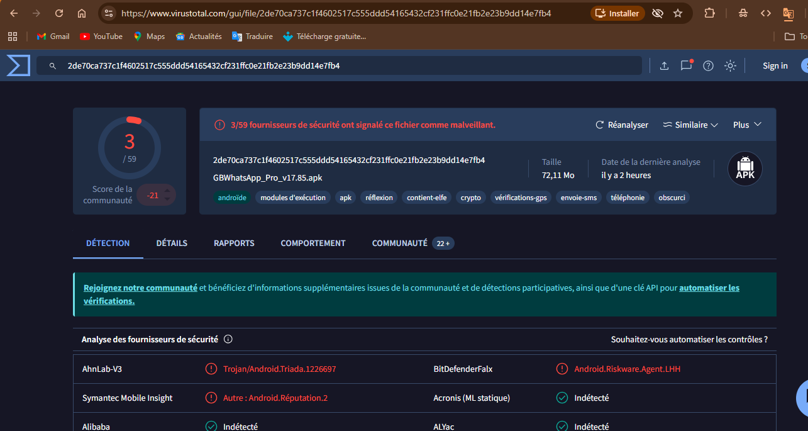
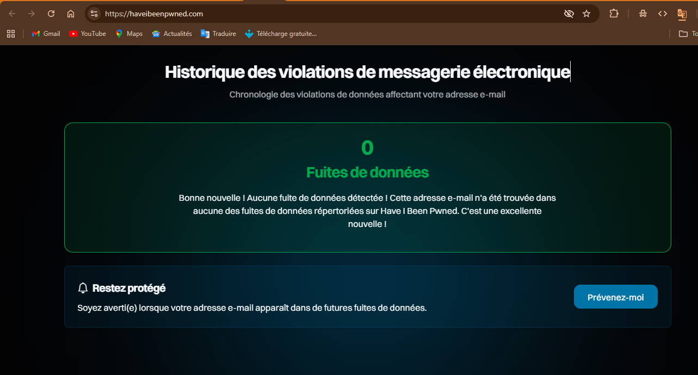
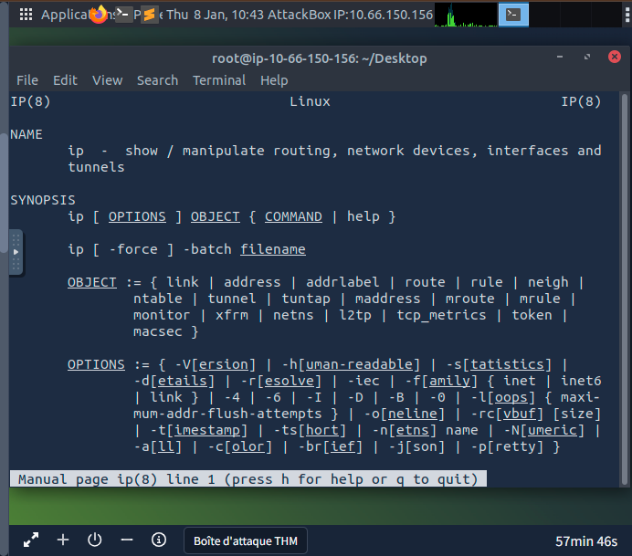
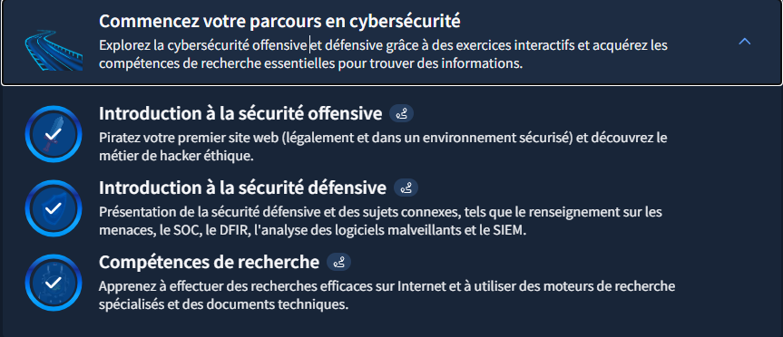

# TryHackMe - Module "Commencez votre parcours en cybersécurité"

## Objectif du Module
Apprendre à effectuer des recherches efficaces sur Internet et à utiliser des moteurs de recherche spécialisés ainsi que la documentation technique.

## Concepts clés appris

### Évaluation des résultats de recherche
Sur Internet, chacun peut publier du contenu : billets de blog, articles, publications sur les réseaux sociaux, ou même modifier des pages wiki publiques. En tant que lecteurs et chercheurs d'informations fiables, nous devons absolument vérifier plusieurs points :

- **Source** : Identifier l'auteur ou l'organisation qui publie l'information, vérifier sa réputation et son autorité dans le domaine. Une publication sur un blog ne confère pas automatiquement l'expertise sur le sujet.

- **Preuves et raisonnement** : Vérifier si les affirmations sont étayées par des preuves crédibles et un raisonnement logique, rechercher des faits concrets et des arguments solides.

- **Objectivité et impartialité** : Évaluer si l'information est présentée de manière impartiale et rationnelle, tenir compte de multiples points de vue, éviter les auteurs poursuivant des objectifs douteux (promotion de produit ou attaque de concurrent).

- **Confirmation et cohérence** : Valider les informations en les faisant corroborer par plusieurs sources indépendantes, vérifier si plusieurs sources fiables et reconnues s'accordent sur les affirmations principales.

---

### Moteurs de recherche
Nous avons tous déjà utilisé un moteur de recherche, mais rares sont ceux qui ont exploité pleinement son potentiel. Presque tous les moteurs de recherche permettent d'effectuer des recherches avancées. Voici quelques exemples :
- Google
- Bing
- DuckDuckGo

#### Opérateurs de recherche Google :

**1. L'opérateur de phrase exacte `" "`**
L'utilisation des guillemets permet de forcer le moteur de recherche à trouver une occurrence identique au terme saisi, dans l'ordre exact des mots. C'est un outil indispensable en OSINT (Open Source Intelligence).

*Exemple* : En recherchant `"reconnaissance passive"`, vous éliminez les pages qui traitent séparément de la "reconnaissance" militaire ou de la "sécurité passive" pour ne cibler que le concept technique précis.

Cet opérateur est particulièrement efficace pour :
- Rechercher des messages d'erreur spécifiques lors d'un audit de sécurité
- Identifier des noms d'utilisateurs ou des adresses emails précis
- Trouver des vulnérabilités connues en recherchant la version exacte d'un logiciel (ex: `"vulnerable_software 1.2.3"`)

**2. L'opérateur `site:`**
Cet opérateur permet de restreindre la recherche à un nom de domaine spécifique.

*Exemple* : Pour rechercher le terme exact "cybersécurité" sur mon portfolio GitHub Pages :  
`site:norbertaziamadji.github.io "cybersécurité"`

**3. L'opérateur d'exclusion `-`**
Le signe moins permet d'exclure les résultats contenant un mot ou une expression spécifique.

*Exemple* : Pour rechercher des informations sur les pyramides sans contenu touristique :  
`pyramides -tourisme`

*Note* : Il ne doit pas y avoir d'espace entre le signe moins et le mot à exclure (utilisez `-tourisme` et non `- tourisme`).

*Exemple avancé* : Pour voir les pages de mon site qui parlent de développement web, mais exclure celles sur MySQL :  
`site:norbertaziamadji.github.io développement web -MySQL`

**4. L'opérateur `filetype:`**
Cet opérateur est indispensable pour cibler des documents spécifiques plutôt que des pages HTML classiques. En cybersécurité et en OSINT, il permet d'identifier des fichiers potentiellement sensibles ou des rapports techniques.

Formats courants :
- `pdf` (rapports, CV, e-books)
- `docx` / `doc` (documents Word)
- `xlsx` / `xls` (tableaux de données)
- `pptx` / `ppt` (présentations)

*Exemple* : Pour trouver des présentations PowerPoint sur la cybersécurité :  
`cybersecurity filetype:ppt`

*Astuces* :
- `ext:` est un alias de `filetype:` (ex: `ext:pdf`)
- Aucun espace entre les deux points et l'extension
- Pour un audit de sécurité : `site:nomdusite.com filetype:env` ou `filetype:log`

*Autre exemple* : Pour limiter votre recherche Google aux fichiers PDF contenant "rapport sur la cyberguerre" :  
`filetype:pdf "cyber warfare report"`  
ou  
`ext:pdf "cyber warfare report"`

---

### Moteurs de recherche spécialisés
Il existe plusieurs moteurs de recherche spécialisés particulièrement utiles en cybersécurité :

**1. Shodan** - [shodan.io](https://www.shodan.io)  
Moteur de recherche pour les appareils connectés à Internet. Permet de rechercher des types et versions spécifiques de serveurs, d'équipements réseau, de systèmes de contrôle industriel et d'objets connectés (IoT).

**2. Censys** - [search.censys.io](https://search.censys.io)  
Se concentre sur les hôtes, sites web, certificats et autres ressources Internet. Utilisations : énumération des domaines, audit des ports ouverts, détection des ressources non autorisées.

**3. VirusTotal** - [virustotal.com](https://www.virustotal.com)  
Service d'analyse antivirus pour fichiers et URLs utilisant plusieurs moteurs antivirus simultanément. Permet de vérifier les empreintes numériques des fichiers.

**4. Have I Been Pwned (HIBP)** - [haveibeenpwned.com](https://haveibeenpwned.com)  
Informe si une adresse e-mail a été compromise lors d'une fuite de données. Important car de nombreux utilisateurs réutilisent les mêmes mots de passe sur plusieurs plateformes.

---

### Vulnérabilités et exploits

**CVE (Common Vulnerabilities and Exposures)**  
Répertoire des vulnérabilités fournissant un identifiant standardisé (format `CVE-2024-29988`). Cet identifiant unique garantit que tous les acteurs font référence à la même vulnérabilité.

**Bases de données d'exploits**
- **Exploit Database** : Répertorie des codes d'exploitation testés et validés
- **GitHub** : Contient de nombreux outils liés aux CVE, preuves de concept (PoC) et codes d'exploitation

*Important* : Ne jamais tenter d'exploiter un système vulnérable sans autorisation formelle.

### Documentation technique
Il est important d'acquérir la capacité à consulter la documentation officielle.

**Pages de manuel Linux**  
Chaque commande Linux possède une page de manuel. Pour consulter celle de la commande `ip` :  
`man ip` (taper `q` pour quitter)

**Documentation Microsoft Windows**  
Microsoft propose une documentation technique officielle pour ses produits.

**Documentation produit**  
Sources fiables pour les caractéristiques et fonctionnalités des produits :
- Documentation officielle de Snort
- Documentation du serveur HTTP Apache
- Documentation PHP
- Documentation Node.js

*Conseil* : Toujours consulter la documentation officielle, car elle est la plus à jour et offre les informations les plus complètes.

### Réseaux sociaux
Les réseaux sociaux (Facebook, Twitter/X, LinkedIn, Instagram) offrent une mine d'informations pour les professionnels de la cybersécurité.

**Aspects sécurité :**
- Surveiller les informations partagées par les employés (réponses aux questions secrètes, etc.)
- Éviter le partage excessif d'informations personnelles

**Avantages professionnels :**
- Se connecter avec entreprises et personnes intéressantes
- Suivre des canaux et groupes techniques spécialisés
- Développer son expertise dans un environnement propice

## Pratique & Commandes

### Tests sur Google :
- `"cybersécurité"` : Recherche exacte du terme
- `site:norbertaziamadji.github.io "cybersécurité"` : Recherche sur mon portfolio
- `site:norbertaziamadji.github.io développement web -MySQL` : Recherche avec exclusion
- `filetype:pdf "cyber warfare report"` : Recherche de documents PDF spécifiques

### Moteurs de recherche spécialisés :
- **Shodan** : Recherche d'appareils connectés
- **Censys** : Audit de ressources Internet
- **VirusTotal** : Analyse de fichiers suspects
- **HIBP** : Vérification de compromission d'emails

### Documentation :
- `man ip` : Consultation du manuel Linux
- Recherche de documentation produit officielle

## Screenshots

### Moteurs de recherche

### Moteurs de recherche spécialisés

### Documentation technique

### Completion du module

* **Module terminé à 100%**
* **Date :** 29/12/2025
* **Plateforme :** TryHackMe

**Note :** J'utilise actuellement un compte TryHackMe gratuit. Ma progression dans ce parcours est donc limitée aux salles accessibles sans abonnement.

## Difficultés personnelles
Je n'ai eu aucune difficulté dans ce module.

## Application freelance cybersécurité

Les compétences acquises dans ce module ouvrent plusieurs opportunités de services freelance :

### 1. Recherche OSINT (Open Source Intelligence)
- **Audit d'empreinte numérique** pour entreprises :  
  Identifier ce que révèle Internet sur leur infrastructure, employés, données exposées
- **Vérification de fuites de données** :  
  Utiliser HIBP et autres outils pour vérifier si les emails de l'entreprise ont été compromis

### 2. Veille sécurité
- **Veille vulnérabilités** pour petites entreprises :  
  Surveillance des CVE affectant leurs logiciels, alertes personnalisées
- **Analyse de menaces** :  
  Utiliser VirusTotal et autres moteurs pour analyser des fichiers suspects

### 3. Audit de présence en ligne
- **Analyse d'exposition** :  
  Utiliser Shodan/Censys pour identifier les services exposés, configurations dangereuses
- **Vérification documentation technique** :  
  S'assurer que les équipes ont accès aux bonnes ressources techniques

### Services concrets proposables :
- **"Audit OSINT rapide"** :  
  Recherche Google avancée + vérification HIBP + analyse Shodan basique
- **"Formation recherche efficace"** :  
  Enseigner les opérateurs Google avancés aux équipes techniques
- **"Veille sécurité mensuelle"** :  
  Rapport mensuel des vulnérabilités et menaces pertinentes

### Pour ma pratique personnelle :
Ces compétences me permettent d'effectuer des **recherches plus efficaces** pour :
- Trouver des solutions techniques précises
- Identifier des vulnérabilités potentielles dans mes projets
- Me tenir informé des dernières menaces
- Améliorer la qualité de mes audits futurs

## Leçons retenues
Ce module m'a permis de comprendre comment :
- Évaluer efficacement les sources d'information
- Utiliser les moteurs de recherche de manière avancée
- Explorer les moteurs de recherche spécialisés en cybersécurité
- Consulter efficacement la documentation technique
- Utiliser les réseaux sociaux à des fins professionnelles
- Consulter les médias d'information de manière critique

L'**OSINT** (recherche de sources ouvertes) est une compétence fondamentale en cybersécurité, aussi importante que les compétences techniques. Savoir trouver, évaluer et utiliser l'information correctement fait la différence entre un bon et un excellent professionnel.

---

*Writeup rédigé par **Norbert Aziamadji** dans le cadre de mon apprentissage en cybersécurité.*  
*Étudiant en cybersécurité au Bénin | [GitHub](https://github.com/norbertaziamadji) | [TryHackMe](https://tryhackme.com/p/norbertaziamadji)*

**Dernière mise à jour :** 08/01/2026