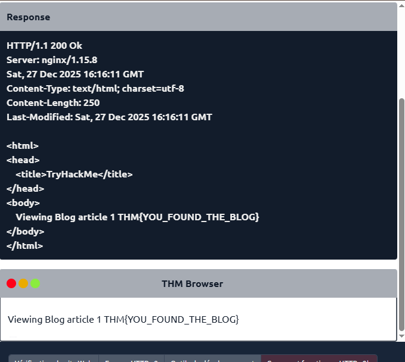
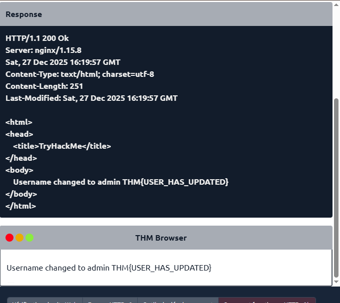
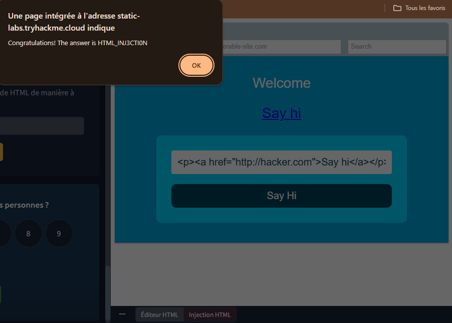
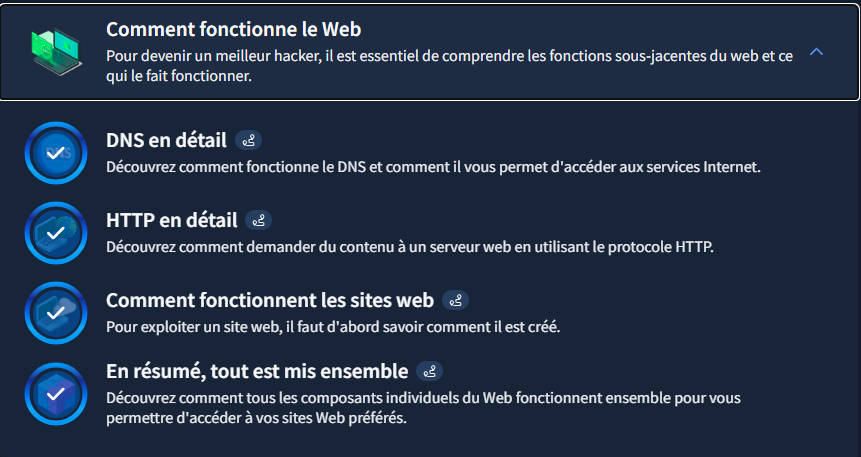

# TryHackMe - Comment fonctionne le web

## Objectif du Module
Comprendre les fonctions sous-jacentes du web et ce qui le fait fonctionner.

## Concepts clés appris

### DNS in Detail
- **DNS (Domain Name System)** : moyen de communication entre appareils sur internet sans se souvenir de chiffres complexes.
- Dans l'hiérarchie du domaine, il y a 3 niveaux de domaines :
  1. Root Domain qui est : "."
  2. Top-Level Domain comme : .edu -- .com -- .gov -- .mil
  3. Second-Level Domain comme : MIT -- Google, TryHackMe -- USA, NASA -- Army
- **TLD** : partie la plus droite d'un nom de domaine.

Il existe deux types de **TLD** : gTLD (Generic Top Level) et ccTLD (Country Code Top Level Domain).
- gTLD : destiné à indiquer à l'utilisateur le but du nom de domaine (ex: .com pour commercial, .org pour organisation, .edu pour éducation, .gov pour gouvernement)
- ccTLD : utilisé à des fins géographiques (ex: .ca pour Canada, .co.uk pour Royaume-Uni)

Un sous-domaine se trouve sur le côté gauche du domaine de second niveau en utilisant une période pour le séparer (ex: admin.tryhackme.com).

- Types d'enregistrements DNS : **Record, AAAA, CNAME Record, MXRecord, Enregistrement TXT**

### HTTP in Detail
- **HTTP (HyperText Transfer Protocol)** : ensemble de règles utilisées pour communiquer avec les serveurs Web pour la transmission de données de page Web (HTML, images, vidéos, etc.)
- **HTTPS (HyperText Transfer Protocol Secure)** : version sécurisée de HTTP avec données cryptées
- **URL (Uniform resource locator)** : instruction sur la façon d'accéder à une ressource sur Internet

Une URL est composée de 7 fonctionnalités :
  - Scheme (Schéma)
  - User (Utilisateur)
  - Host/Domain (Hôte)
  - Port
  - Path (Chemin)
  - Query String (Chaîne de requête)
  - Fragment

Méthodes HTTP : **GET, POST, PUT, DELETE**

Codes d'état HTTP (5 gammes) :
  - 100-199 : Réponse à l'information
  - 200-299 : Succès
  - 300-399 : Redirection
  - 400-499 : Erreurs du client
  - 500-599 : Erreurs de serveur

Codes d'état courants :
  - 200 - OK
  - 201 - Créé
  - 301 - Déplacé de façon permanente
  - 302 - Trouvé
  - 400 - Mauvaise demande
  - 401 - Non Autorisé
  - 403 - Interdit
  - 405 - Méthode Non Autorisée
  - 404 - Page Non Trouvée
  - 500 - Erreur de service interne
  - 503 - Service Indisponible

Types d'en-têtes :
  - En-têtes de requête : Host, User-Agent, Content-Length, Accept-Encoding, Cookie
  - En-têtes de réponse : Set-Cookie, Cache-Control, Content-Type, Content-Encoding

**Cookies** : petit morceau de données qui est stocké sur notre ordinateur

### How The Web Works
Lorsqu'on visite un site Web, notre navigateur fait une demande à un serveur Web qui traite la demande et renvoie les données.

Composantes d'un site Web :
1. **Front End (Client-Side)** : rendu du site Web via HTML, CSS et JS
2. **Back End (Server-Side)** : serveur qui traite les demandes via PHP, Python, etc.

**Note** : Lors de l'évaluation de sécurité d'une application web, examiner le code source de la page peut révéler des identifiants de connexion exposés ou des liens cachés.

**L'injection HTML** : vulnérabilité qui se produit lorsque des données saisies par l'utilisateur ne sont pas filtrées et affichées sur une page, permettant à un attaquant d'injecter du code HTML malveillant.

## Pratique & Commandes

### Commandes DNS :
- `nslookup --type=CNAME shop.website.thm` → Voir le CNAME de shop.website.thm
- `nslookup --type=TXT website.thm` → Voir la valeur de l'enregistrement TXT de website.thm
- `nslookup --type=MX website.thm` → Voir la valeur numérique de priorité pour l'enregistrement MX
- `nslookup --type=A www.website.thm` → Voir l'adresse IP pour le dossier A de www.website.thm

## Screenshots

### Tests DNS :

### Tests HTTP :
- GET : 
- GET avec id = 1 : 
- DELETE : 
- PUT : 
- POST : 

### Injection HTML :

### Capture d'écran TryHackMe :

* **Module terminé à 100%**
* **Date :** 24/12/2025
* **Plateforme :** TryHackMe

**Note :** J'utilise actuellement un compte TryHackMe gratuit. Ma progression dans ce parcours est donc limitée aux salles accessibles sans abonnement.

## Difficultés personnelles
Du premier coup, je n'ai pas réussi le lab sur les méthodes GET, POST, PUT et DELETE. Il m'a fallu le reprendre une seconde fois pour voir que ce n'était pas vraiment compliqué.

## Application freelance cybersécurité
Les connaissances acquises dans ce module sur le fonctionnement du web ouvrent plusieurs opportunités de services freelance :

### Audit de sécurité web basique
- **Vérification DNS** : Analyser la configuration DNS des clients pour détecter des enregistrements malveillants ou des sous-domaines non sécurisés
- **Test des en-têtes HTTP** : Vérifier si les en-têtes de sécurité (Content-Security-Policy, X-Frame-Options) sont correctement configurés
- **Analyse des cookies** : Examiner si les cookies de session sont sécurisés (flags HttpOnly, Secure)

### Détection de vulnérabilités courantes
- **Identification d'injection HTML** : Scanner des sites web pour détecter des champs non filtrés susceptibles d'injection HTML
- **Vérification des méthodes HTTP** : S'assurer que les méthodes sensibles (PUT, DELETE) sont correctement restreintes
- **Analyse de code source** : Examiner le code source des pages pour identifier des informations sensibles exposées

### Services de conseil pour développeurs web
- **Formation aux bonnes pratiques HTTP** : Enseigner aux développeurs comment implémenter HTTPS correctement
- **Configuration DNS sécurisée** : Aider à configurer des enregistrements DNS (SPF, DKIM) pour prévenir le phishing
- **Guide de sécurisation des formulaires** : Montrer comment filtrer les entrées utilisateur pour prévenir les injections

### Optimisation de performance et sécurité
- **Configuration de CDN** : Aider à mettre en place des Content Delivery Networks pour améliorer sécurité et performance
- **Audit des codes d'état** : Vérifier que les erreurs ne divulguent pas d'informations sensibles
- **Analyse de la stack technologique** : Identifier les technologies vulnérables côté frontend et backend

### Perspectives d'évolution
Ces compétences constituent une base solide pour des services plus avancés :
- Tests d'intrusion d'applications web (Web App Pentesting)
- Configuration de WAF (Web Application Firewall)
- Audit de conformité RGPD pour les cookies et tracking
- Formation en sensibilisation aux menaces web pour les employés

Ces services sont particulièrement recherchés par les petites et moyennes entreprises qui développent leur présence en ligne mais n'ont pas d'expertise sécurité interne.

---

**Remarque :** J'ai approfondi mes recherches sur internet. Ces recherches m'ont permis de comprendre et de voir les services proposables, mais également de savoir comment mieux maîtriser ces nouvelles compétences.

## Leçons retenues
En résumé, lorsque qu'on consulte un site web, notre ordinateur doit connaître l'adresse IP du serveur auquel il doit se connecter ; pour cela, il utilise le DNS. Notre ordinateur communique ensuite avec le serveur web grâce à un ensemble de commandes spécifiques appelé protocole HTTP ; le serveur web renvoie alors du code HTML, JavaScript, CSS, des images, etc., que notre navigateur utilise pour formater et afficher correctement le site web.

Il existe également quelques autres composants qui contribuent à un fonctionnement plus efficace du Web et offrent des fonctionnalités supplémentaires tels qu'un **équilibreurs de charge, un CDN (Content Delivery Networks), une base de données, un WAF (Web Application Firewall).**

**Note :** Un serveur web est un logiciel qui écoute les connexions entrantes et utilise le protocole HTTP pour fournir du contenu web à ses clients.

**Règle générale :** Ne jamais se fier aux données saisies par l'utilisateur. Pour éviter toute saisie malveillante, le développeur du site web doit nettoyer systématiquement toutes les données saisies par l'utilisateur avant de les utiliser dans la fonction JavaScript ; par exemple, il pourrait supprimer les balises HTML.

---

*Writeup rédigé par **Norbert Aziamadji** dans le cadre de mon apprentissage en cybersécurité.*  
*Étudiant en cybersécurité au Bénin | [GitHub](https://github.com/norbertaziamadji) | [TryHackMe](https://tryhackme.com/p/DarkGhost6)*

**Dernière mise à jour :** 28/12/2025