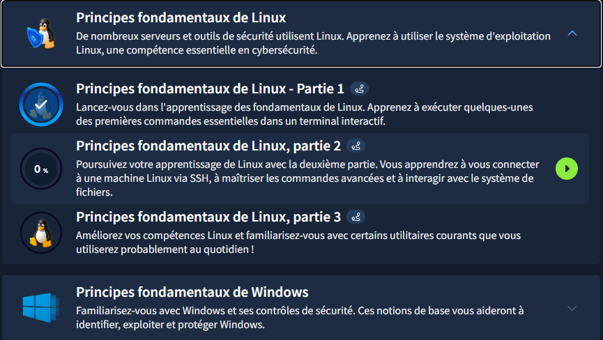

# TryHackMe - Les fondamentaux de Linux

## Objectif du Module
Apprendre à utiliser le système d'exploitation Linux, une compétence essentielle en cybersécurité.

## Concepts clés appris

### Notions Fondamentales
Linux, créé par Linus Torvalds, a été publié pour la première fois le 17 septembre 1991. C'est aujourd'hui un système d'exploitation incontournable en cybersécurité.

**Utilisations courantes de Linux :**
- Sites Web que nous visitons
- Panneaux de commande/divertissement pour voitures
- Systèmes de point de vente (PDV) tels que les caisses enregistreuses et les terminaux de paiement
- Infrastructures critiques telles que les contrôleurs de feux de circulation ou les capteurs industriels

### Importance de Linux en Cybersécurité
- **Outils de hacking** : La majorité des outils (Kali, Metasploit) tournent sur Linux
- **Transparence** : Open source → possibilité d'auditer le code
- **Contrôle** : Accès complet au système via terminal
- **Stabilité** : Moins vulnérable aux malwares que Windows

## Pratique & Commandes

### Mes premières commandes
- `echo "Hello Friend !"`
- `whoami`

### Interaction avec le système de fichiers
- `ls` - Lister le contenu
- `cd Images` - Changer de répertoire
- `cat todo.txt` - Afficher le contenu d'un fichier
- `pwd` - Afficher le répertoire courant

### Recherche de fichiers
- `find -name passwords.txt`
- `find -name *.txt`
- `grep "81.143.211.90" access.log`
- `wc -l access.log`

### Opérateurs Shell
- `python3 -m http.server 80 &`
- `command1 && command2`
- `echo hey > welcome`
- `echo hello >> welcome`

## Screenshots

### Premières commandes

### Interaction avec le système de fichiers

### Recherche de fichiers

### Opérateurs Shell

### Capture d'écran TryHackMe

* **Module terminé à 20%**
* **Date :** 25/12/2025
* **Plateforme :** TryHackMe

**Note :** J'utilise actuellement un compte TryHackMe gratuit. Ma progression dans ce parcours est donc limitée aux salles accessibles sans abonnement.

## Difficultés personnelles
*Aucune difficulté particulière*

## Application freelance cybersécurité

Les compétences Linux fondamentales acquises dans ce module ouvrent de nombreuses opportunités de services freelance en cybersécurité :

### Administration système de base
- **Maintenance de serveurs Linux** : Surveillance, mise à jour et dépannage de serveurs clients
- **Gestion des utilisateurs et permissions** : Configuration sécurisée des comptes et droits d'accès
- **Automatisation de tâches** : Création de scripts shell pour automatiser des processus répétitifs

### Audit de sécurité Linux
- **Analyse de journaux système** : Utilisation de `grep`, `awk`, `sed` pour investiguer des incidents
- **Vérification de l'intégrité des fichiers** : Surveillance des changements critiques avec outils comme `find`
- **Audit de configuration** : Vérification des paramètres de sécurité système

### Services de réponse aux incidents
- **Investigation forensique basique** : Recherche d'indicateurs de compromission dans les systèmes Linux
- **Analyse de malware sur Linux** : Utilisation des outils en ligne de commande pour examiner des fichiers suspects
- **Récupération de données** : Assistance pour récupérer des fichiers supprimés ou corrompus

### Formation et support technique
- **Formation aux bases Linux** : Enseigner les commandes essentielles aux équipes non-techniques
- **Création de documentation** : Développer des guides de référence des commandes pour les équipes IT
- **Support d'urgence** : Assistance à distance pour résoudre des problèmes Linux critiques

### Préparation à la certification
- **Préparation LPIC-1/Linux+** : Coaching pour les certifications Linux de base
- **Simulations d'examen** : Création d'environnements de pratique pour les candidats

### Perspectives d'évolution
Ces compétences de base permettent d'évoluer vers des services plus avancés :
- **Pentesting d'infrastructures Linux** : Tests d'intrusion sur serveurs et réseaux
- **Sécurisation avancée de serveurs** : Hardening, configuration de SELinux/AppArmor
- **DevSecOps** : Intégration de la sécurité dans les pipelines CI/CD Linux

**Remarque :** J'ai approfondi mes recherches sur internet. Ces recherches m'ont permis de comprendre et de voir les services proposables, mais également de savoir comment mieux maîtriser ces nouvelles compétences.

## Leçons retenues
J'ai pu comprendre pourquoi Linux est si répandu aujourd'hui. J'ai interagi avec une machine virtuelle Linux et exécuté certaines des commandes les plus fondamentales en interagissant avec le système de fichiers. J'ai appris comment utiliser des commandes comme `find` et `grep` pour rendre la recherche de données plus efficace tout en améliorant également mes compétences en découvrant certains des opérateurs shell les plus importants.

---

*Writeup rédigé par **Norbert Aziamadji** dans le cadre de mon apprentissage en cybersécurité.*  
*Étudiant en cybersécurité au Bénin | [GitHub](https://github.com/norbertaziamadji) | [TryHackMe](https://tryhackme.com/p/DarkGhost6)*

**Dernière mise à jour :** 28/12/2025