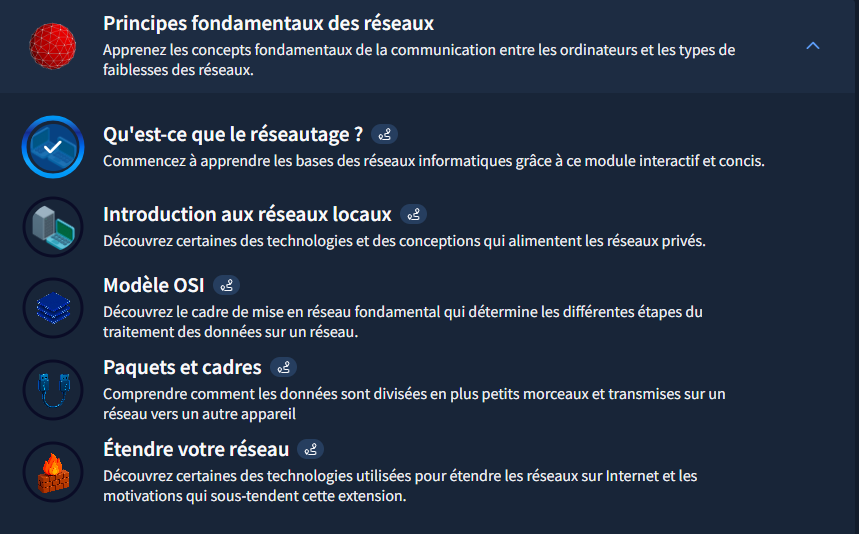

# TryHackMe - Module "Les fondamentaux du réseau"

## Objectif du Module
Apprendre les bases des réseaux informatiques : adressage, protocoles et communication entre appareils.

## Concepts clés appris

### Notions Fondamentales
- **Réseautage (Networking)** : Interconnexion d'appareils (de 2 à des milliards)
- **Internet** : Réseau géant composé de réseaux plus petits
- **Types de réseaux** : Privé (interne) vs Public (accessible)

### Identification des Appareils
- **Adresse IP** (IPv4/IPv6) : Identifiant unique d'un appareil sur un réseau
  - IPv4 : 4,29 milliards d'adresses (pénurie actuelle)
  - IPv6 : 340 billions d'adresses (solution long terme)
- **Adresse MAC** : Identifiant matériel unique de l'interface réseau
  - Format : 12 caractères hexadécimaux (ex: a4:c3:f0:85:ac:2d)
  - 6 premiers = fabricant, 6 derniers = numéro unique

### Protocoles de Communication
- **Ping (ICMP)** : Vérifie la connectivité et mesure les performances
  - Utilise les paquets echo request/echo reply
  - Mesure le temps aller-retour entre appareils

## Pratique & Commandes

* Commande Linux de test de connectivité de base :

`ping -c 4 8.8.8.8` ----> serveur Google

## Screenshots

### Preuve du test ping -c 4 8.8.8.8

### Capture d'écran TryHackMe

* **Module terminé à 20%**
* **Date :** 23/12/2025
* **Plateforme :** TryHackMe

**Note :** J'utilise actuellement un compte TryHackMe gratuit. Ma progression dans ce parcours est donc limitée aux salles accessibles sans abonnement.

## Difficultés rencontrées
Aucune pour cette introduction, les concepts étaient bien expliqués.

## Application freelance cybersécurité
Les connaissances acquises dans ce module sur les fondamentaux du réseau sont directement applicables dans plusieurs services de freelance en cybersécurité :

### Audit de réseau basique
- **Diagnostic de connectivité** : Utiliser les commandes `ping` pour vérifier l'accessibilité des serveurs clients
- **Cartographie réseau simple** : Identifier les appareils actifs sur un petit réseau local
- **Vérification de configuration IP** : S'assurer que les adressages sont correctement configurés.

### Support technique avancé
- **Résolution de problèmes de connexion** : Diagnostiquer les pannes réseau niveau couche 3
- **Explication des concepts réseau** : Aider les clients à comprendre les différences entre IP publique/privée, IPv4/IPv6
- **Optimisation de connectivité** : Recommander des améliorations basées sur les tests de performance réseau

### Services conseil pour petites entreprises
- **Architecture réseau basique** : Concevoir des schémas réseau simples pour startups
- **Formation employés** : Enseigner les bases de la sécurité réseau aux équipes non-techniques
- **Documentation technique** : Créer des guides de dépannage réseau pour les équipes IT

### Perspectives d'évolution
Ces compétences de base ouvrent la voie vers des services plus avancés :
- Analyse de trafic réseau (Wireshark)
- Configuration de pare-feu basique
- Tests d'intrusion réseau
- Sécurisation de configurations réseau

**Remarque :** J'ai approfondi mes recherches sur internet. Ces recherches m'ont permis de comprendre et de voir les services proposables, mais également de savoir comment mieux maîtriser ces nouvelles compétences.

## Leçons retenues

### Ce que j'ai compris
Un réseau local peut commencer avec seulement deux appareils. Comprendre la différence entre **adresse IP** (logique, réseau) et **adresse MAC** (physique, matériel) est fondamental pour identifier les appareils. Le **ping (ICMP)** permet de diagnostiquer la connectivité en mesurant les temps de réponse.

> "L'adresse MAC identifie le matériel, l'adresse IP identifie l'appareil sur le réseau. L'une est physique (usine), l'autre est logique (configuration)."

---

*Writeup rédigé par **Norbert Aziamadji** dans le cadre de mon apprentissage en cybersécurité.*  
*Étudiant en cybersécurité au Bénin | [GitHub](https://github.com/norbertaziamadji) | [TryHackMe](https://tryhackme.com/p/DarkGhost6)*

**Dernière mise à jour :** 28/12/2025