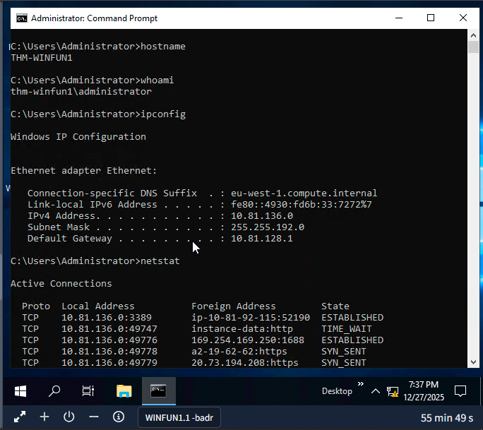
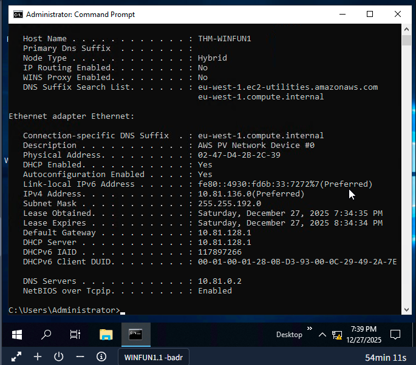
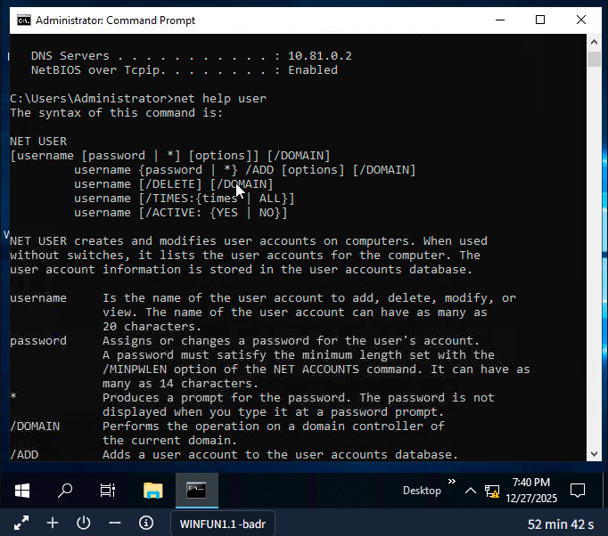
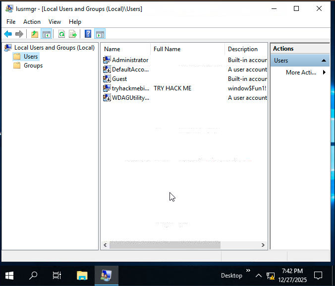
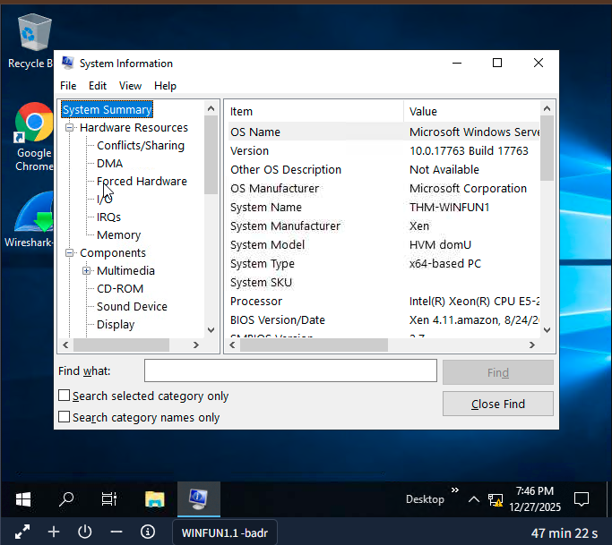
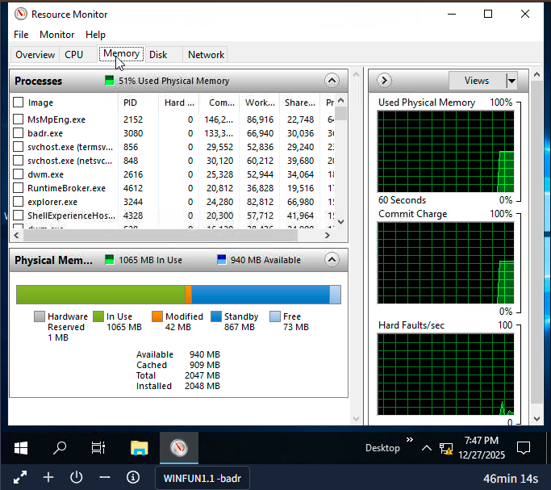
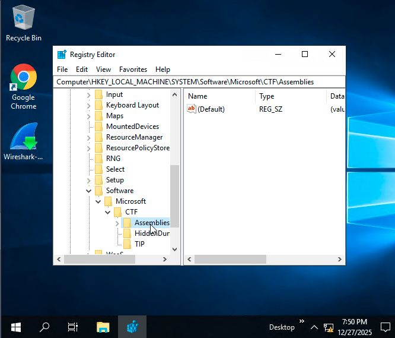
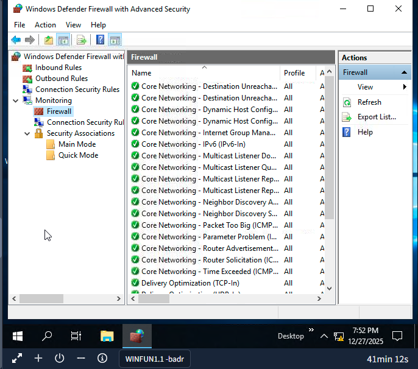
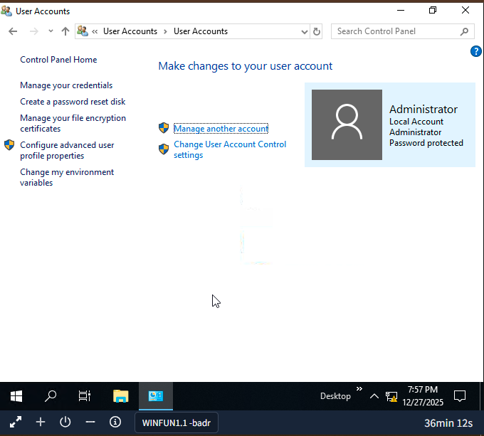

# TryHackMe - Module "Principes fondamentaux de Windows"

## Objectif du Module
Comprendre l'architecture, la sécurité et l'administration du système d'exploitation Windows, cible principale en cybersécurité.

## Concepts clés appris

### Éditions et Histoire de Windows
- Windows remonte à 1985 et est le système d'exploitation dominant pour particuliers et entreprises
- Cible privilégiée des pirates et créateurs de logiciels malveillants
- BitLocker : chiffrement disponible sur les versions Pro mais pas sur Home

### Système de Fichiers NTFS
- **NTFS** (New Technology File System) : système de fichiers moderne de Windows
- Avantages par rapport à FAT16/FAT32 et HPFS :
  - Fichiers > 4 Go
  - Permissions spécifiques sur fichiers/dossiers
  - Compression et chiffrement (EFS)
  - Système journalisé (réparation automatique)

### Permissions NTFS
- Contrôle total, Modifier, Lire et exécuter, Liste du contenu, Lire, Écrire
- Consultation : Clic droit → Propriétés → Onglet Sécurité

### Flux de Données Alternatifs (ADS)
- Attribut spécifique à NTFS permettant plusieurs flux de données par fichier
- Non affiché nativement par l'Explorateur Windows
- Visible via PowerShell ou outils tiers

### Variables d'Environnement
- Stockent des informations sur l'environnement système
- `%windir%` : variable système pour le dossier Windows
- Accessibles via : Paramètres → Système → À propos → Paramètres système avancés → Variables d'environnement

### Comptes Utilisateurs et Autorisations
- Deux types : **Administrateur** (modifications système) et **Utilisateur standard** (limité)
- Gestion : `lusrmgr.msc` ou "Ajouter quelqu'un d'autre à ce PC"

### Contrôle de Compte Utilisateur (UAC)
- Introduit avec Windows Vista
- Quatre niveaux de sécurité :
  1. Toujours notifier (niveau maximal)
  2. Notifications pour les applications (défaut)
  3. Notification sans atténuation
  4. Ne jamais envoyer de notifications
- Non applicable par défaut au compte administrateur local intégré

### Paramètres Système
- **Panneau de configuration** : modifications système traditionnelles
- **Menu Paramètres** : introduit avec Windows 8, maintenant principal
- **Gestionnaire de tâches** (`Ctrl + Shift + Esc`) : applications, processus, performances

### Configuration Système Avancée
- **MSConfig** : dépannage avancé, diagnostics de démarrage
- **Fichier d'échange** : mémoire virtuelle supplémentaire
- **Fichier de vidage mémoire** : analyse d'écrans bleus
- **Services** : PsShutdown de Systems Internals

### Gestion de l'Ordinateur (`compmgmt`)
1. **Outils système** :
   - Planificateur de tâches : automatisation de tâches
   - Observateur d'événements : journaux système (Application, Sécurité, Système)
   - Moniteur de performances (`perfmon`) : diagnostics de performance
   - Gestionnaire de périphériques : configuration matérielle

2. **Stockage** :
   - Gestion des disques
   - WMI Control (Windows Management Instrumentation)

### Informations Système (`msinfo32`)
- Résumé système : matériel, composants, environnement logiciel
- Spécifications techniques et configurations

### Moniteur de Ressources (`resmon`)
- Utilisation CPU, mémoire, disque, réseau
- Filtrage avancé par processus

### Invite de Commandes
- Commandes essentielles :
  - `hostname` : nom de l'ordinateur
  - `whoami` : utilisateur connecté
  - `ipconfig` : configuration réseau
  - `netstat` : connexions réseau
  - `cls` : effacer l'écran
  - `/?` ou `help` : manuel d'aide
  - `net` : gestion réseau (users, localgroup, share)

### Éditeur du Registre (`regedit`)
- Base de données des configurations système
- Profils utilisateurs, applications, matériel, paramètres
- **Avertissement** : modifications réservées aux experts

### Sécurité Windows
1. **Protection contre les virus et menaces** :
   - Protection en temps réel
   - Protection cloud
   - Contrôle d'accès aux dossiers
   - Exclusions personnalisables
   - Analyses : rapide, complète, personnalisée

2. **Pare-feu Windows Defender** :
   - Trois profils : Domaine, Privé, Public
   - Commande : `WF.msc`

3. **Contrôle d'application et navigateur** :
   - SmartScreen : protection phishing/logiciels malveillants
   - Protection contre les exploits

4. **Sécurité des appareils** :
   - Isolation du noyau
   - TPM (Trusted Platform Module) : cryptographie matérielle

5. **BitLocker** :
   - Chiffrement de lecteur intégré au système
   - Optimisé avec TPM version 1.2+
   - Alternative : clé de démarrage sur lecteur amovible

6. **Service VSS (Volume Shadow Copy)** :
   - Copies instantanées pour sauvegarde/restauration
   - Points de restauration système
   - Cible des attaquants (suppression par ransomwares)

## Pratique & Commandes

### Commandes de base :
* `hostname` :  Affiche le nom de l'ordinateur
* `whoami`   :  Affiche l'utilisateur connecté
* `ipconfig` :  Configuration réseau
* `netstat`  :  Connexions réseau
* `cls`      :  Efface l'écran
* `ipconfig /?` : Aide sur ipconfig
* `net help user` : Aide sur net user

### Outils système :
* **lusrmgr.msc** : Gestion utilisateurs et groupes
* **msconfig** : Configuration système
* **compmgmt** : Gestion de l'ordinateur
* **msinfo32** : Informations système
* **resmon** : Moniteur de ressources
* **regedit** : Éditeur du registre
* **WF.msc** : Pare-feu Windows
* **control.exe** : Panneau de configuration

## Screenshots

### Capture d'écran TryHackMe

* **Module terminé à 20%**
* **Date :** 25/12/2025
* **Plateforme :** TryHackMe

**Note :** J'utilise actuellement un compte TryHackMe gratuit. Ma progression dans ce parcours est donc limitée aux salles accessibles sans abonnement.

## Difficultés personnelles
*J'ai eu un peu de difficulté à maitriser les noms des outils systèmes.*

## Application freelance cybersécurité

### Services accessibles avec mes compétences Windows actuelles :

**1. Audit de sécurité Windows pour petites entreprises :**
- **Vérification des configurations de base** 
  - Analyse des paramètres UAC (niveau de sécurité)
  - Vérification des comptes utilisateurs (administrateurs inutiles)
  - Audit des permissions NTFS sur dossiers partagés
  - Configuration du pare-feu Windows (profils appropriés)

**2. Optimisation de sécurité pour startups :**
- **"Check-up Windows"** (200-400€)
  - Désactivation de services inutiles (`msconfig`)
  - Configuration des mises à jour automatiques
  - Vérification de l'état de Windows Defender
  - Recommandations pour BitLocker (si version Pro)

**3. Formation aux bonnes pratiques Windows :**
- **Atelier "Sécurisez votre PC Windows"** 
  - Gestion sécurisée des comptes utilisateurs
  - Configuration du pare-feu et de Defender
  - Bonnes pratiques pour les sauvegardes (VSS)
  - Détection des comportements suspects

### Services concrets que je peux proposer MAINTENANT :

**Pour les petites entreprises locales (.bj) :**
* Service "Audit Windows Essentiel"
* Vérification des comptes administrateurs
* Analyse des permissions critiques
* Configuration de base du pare-feu
* Checklist des mises à jour manquantes
* Rapport simple avec 5 actions prioritaires

**Pour les travailleurs indépendants :**
* Service "Sécurisation PC Professionnel"
* Configuration Windows Defender optimale
* Paramétrage UAC adapté
* Vérification des points de restauration
* Conseils de sauvegarde simples

## Leçons retenues
Windows est un système d'exploitation complexe avec une histoire riche et une importance cruciale en cybersécurité. Sa popularité en fait une cible de choix pour les attaquants, nécessitant une compréhension approfondie de ses mécanismes de sécurité.

### Points clés :
1. **Sécurité multicouche** : De l'UAC au pare-feu, Windows utilise plusieurs niveaux de protection
2. **Importance du système de fichiers** : NTFS offre des fonctionnalités de sécurité avancées comme les permissions et le chiffrement EFS
3. **Outils intégrés** : Windows fournit de nombreux outils d'administration (`compmgmt`, `msinfo32`, `resmon`)
4. **Protection contre les menaces** : Defender, SmartScreen et BitLocker forment un écosystème de sécurité complet
5. **Vulnérabilités connues** : Des fonctionnalités comme VSS peuvent être exploitées par des attaquants

### Bonnes pratiques :
- Maintenir les mises à jour régulières
- Activer les protections en temps réel
- Utiliser des comptes standard pour les opérations quotidiennes
- Configurer correctement les permissions NTFS
- Sauvegarder régulièrement avec VSS et solutions externes

### À retenir :
"Les attaquants utilisent souvent des outils Windows légitimes pour passer inaperçus (Living Off The Land), rendant essentielle une connaissance approfondie du système pour la détection et la réponse aux incidents."

---

*Writeup rédigé par **Norbert Aziamadji** dans le cadre de mon apprentissage en cybersécurité.*  
*Étudiant en cybersécurité au Bénin | [GitHub](https://github.com/norbertaziamadji) | [TryHackMe](https://tryhackme.com/p/DarkGhost6)*

**Dernière mise à jour :** 28/12/2025